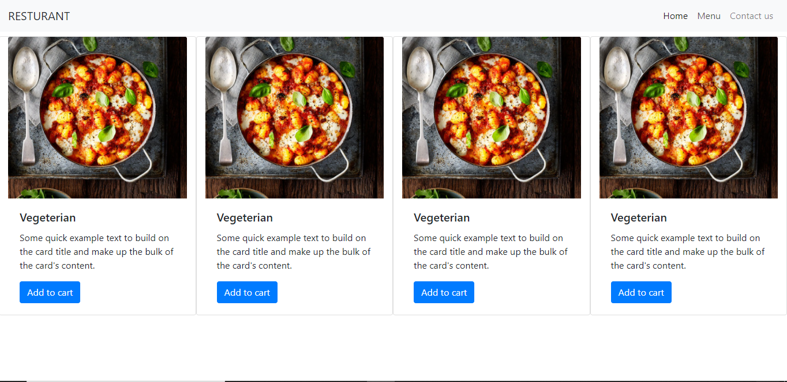

# Restaurant-Page

> This project contains a web page about the Nerium Restaurant. Is build it with webpack.

## Screenshots




## Built With

- HTML5

- SASS

- Javascript

- Webpack

## Live Demo

[Live version](https://hemant-soni-vst-au4.github.io/Resturant/)


## Getting Started

To get a local copy up and running follow these simple example steps.
```
    git@github.com:hemant-soni-vst-au4/Restaurant.git
```

### Prerequisites

- npm

- Nodejs

### Setup

Install dependencies with:

```
    npm install
```

Save a change with:

```
   npm run build
```
or
```
   npm run watch
```

### Usage

Open index.html on your browser

## Author

👤 **Hemant soni**

- Github: [@githubhandle](https://github.com/hemant-soni-vst-au4)
- Twitter: [@twitterhandle](https://twitter.com/abdelperez11)
- Linkedin: [linkedin](https://www.linkedin.com/in/hemant-soni-97427b193/)

## 🤝 Contributing

Contributions, issues and feature requests are welcome!

Feel free to check the [issues page](https://github.com/hemant-soni-vst-au4/Resturant/issues).

## Show your support

Give a ⭐️ if you like this project!

## Acknowledgments

Thanks to Carlos Alfredo Pérez Jiménez for provide the images.

## 📝 License

This project is MIT licensed.
